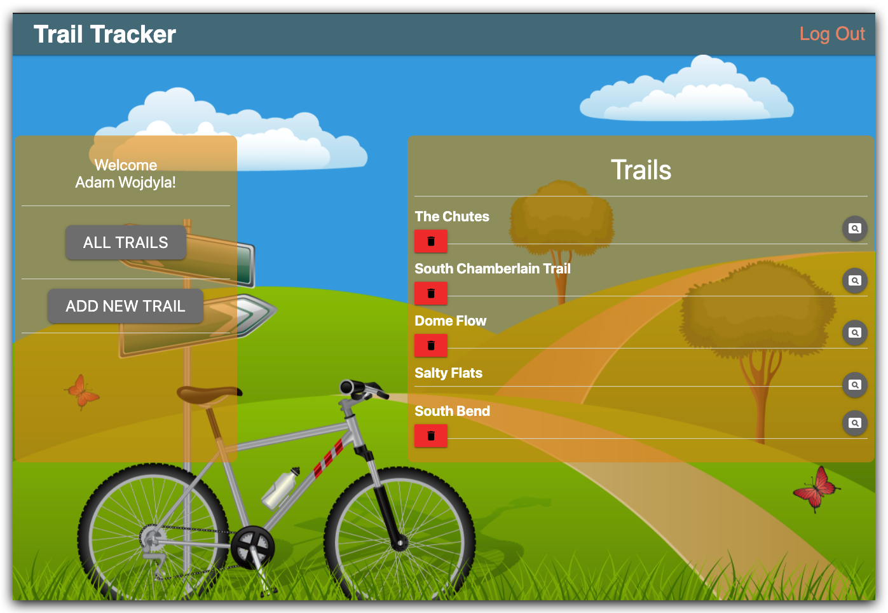
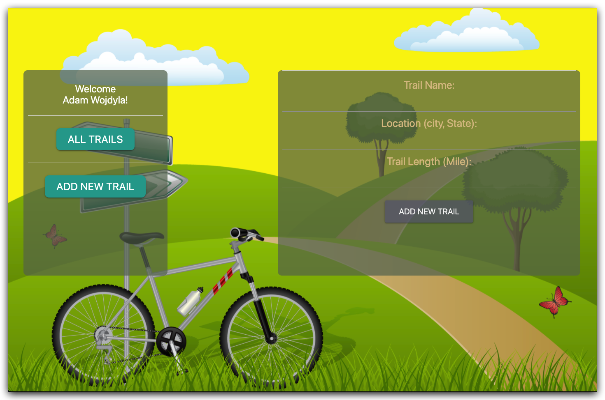
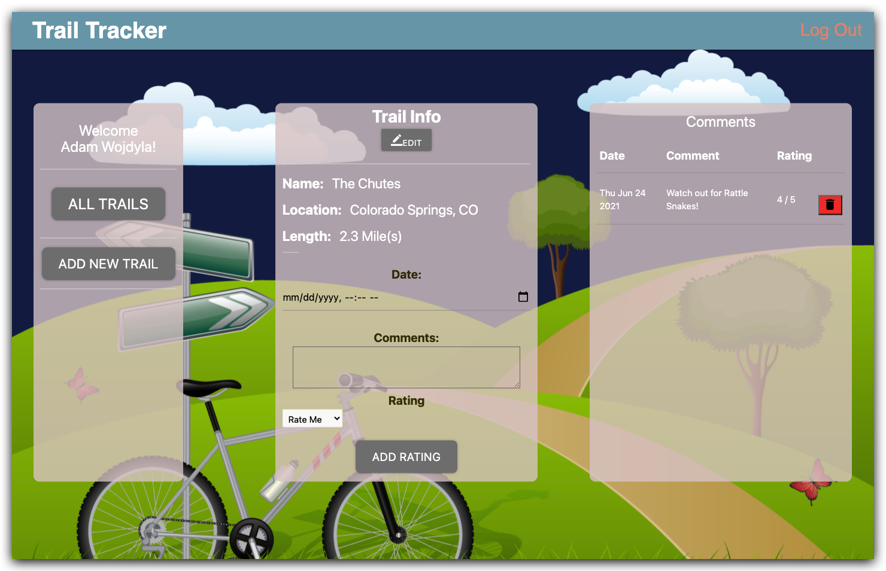

# Trail Tracker
Whether you're a beginner or an experienced cyclist, Trail Tracker is the perfect app to keep track of local and global bicycle trails. Discover new trails and share your own experiences with the community. Easily post new trails along with important information, such as difficulty level, distance, and location. Explore existing trails, view ratings and comments, and plan your next ride with ease. Trail Tracker will help you find the perfect trail for your next adventure!

## Screenshots

---

---

## Technologies Used

### Initial Planning, Database Modeling and Sprint Management
- Jira
- LucidChart
### Web Framework
- Node.js
- Express.js
- Mongoose
- MongoDB 
- EJS
- JavaScript/HTML/CSS
### User Authorization and Authentication
- Google OAuth 2.0
### CI (Continuous Integration), Security, Testing, Cloud Services (AWS)
- GitGuardian
- IAM (Group and User Management) 
- CodePipeline
- CodeBuild
- Elastic BeanStalk
- CloudWatch
- Cypress
---
## Our Team
* Santoiga Alimo : Business Systems Analyst, Technologist
* Marcos Perez Labrada : Developer, Technologist
* Gabo Mishaan : Developer, Technologist
* Adam C Wojdyla : Developer, Technologist
---
## Getting Started
- Click on the link below and go ahead and login via Google (Top right of the application):

[Take me to Trail Tracker](http://code4trailtracker-env.eba-kzdmvpgv.us-east-1.elasticbeanstalk.com/)

- Our team used Jira to organize development of this application, from planning through deployment: 

[Jira Board](https://santoalimo.atlassian.net/jira/software/projects/COD4/boards/1/roadmap?selectedIssue=COD4-1)

---
## Future Features
- Host an API for users to access known trails and their information in their point of interest.
- Create a robust build automation stage that continuously updates and maintains dependencies.
- Migrate database from MondoDB to AWS RDS.

