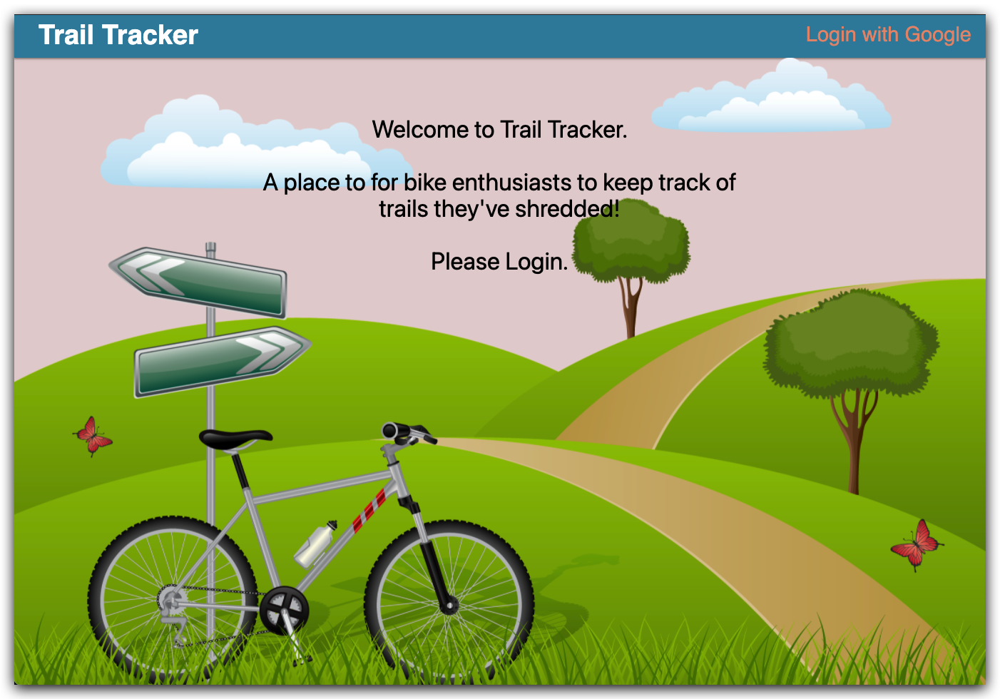

# Trail Tracker
Whether you're a beginner or an experienced cyclist, Trail Tracker is the perfect app to keep track of local and global bicycle trails. Discover new trails and share your own experiences with the community. Easily post new trails along with important information, such as difficulty level, distance, and location. Explore existing trails, view ratings and comments, and plan your next ride with ease. Trail Tracker will help you find the perfect trail for your next adventure!

## Screenshots


---


---


## Installing Trail Tracker (Linux Environment)
*** If you do not have Git, Node and Nodemon installed. Run these commands ***

```
sudo yum install git -y
sudo yum install nodejs
sudo npm i -g nodemon
```
Open your terminal and clone the repository in the desired file path.
```
git clone https://github.com/strategio-tech/fp-sim6-code4.git
```
change directories so that your are inside the root folder
```
cd fp-sim6-code4
```
Check to see if NPM, Node and Nodemon are installed.
```
node -v
npm -v
nodemon -v
```
Install the packages and necessary dependencies to run the application:
```
npm install
npm update
```
Run the application:
```
npm start
```
Go to your local browser and navigate to ``` http://localhost:3000 ```

Use ``` ctrl + c ``` to terminate the application or close the terminal.

---
## Environment Variables
There are several environment variables necessary to run this application.

Create a `.env` file inside the root directory of the project and follow the links below to creating these environment variables.

- [GOOGLE_CLIENT_ID](https://developers.google.com/identity/sign-in/web/sign-in): You'll need an account through the Google Developers Platform to be assigned a Client_ID and Client_Secret for using this feature (allowing users to LOGIN using their Google Account)

- GOOGLE_SECRET: Reference link from GOOGLE_CLIENT_ID above for more details.

- [GITGUARDIAN_API_KEY](https://docs.gitguardian.com/internal-repositories-monitoring/gg_shield/getting_started): This solution was used to ensure as we pushed commits to the remote repository that we were not pushing secrets (such as API Keys)

- GOOGLE_CALLBACK = http://localhost:3000/oauth2callback (This is used locally for production phase of the project only)

- [GOOGLE_CALLBACK](https://www.makeuseof.com/nodejs-google-authentication/) (Follow this link to creating a "Redirect_URL" and assign it to "GOOGLE_CALLBACK in your `.env` file)

[DATABASE_URL](https://www.mongodb.com/blog/post/quick-start-nodejs-mongodb-how-to-get-connected-to-your-database) Create a MongoDB cluster and add the key to the `.env` file
## Technologies Used

### Initial Planning, Database Modeling and Sprint Management
- Jira
- LucidChart
### Web Framework
- Node.js
- Express.js
- Mongoose
- MongoDB 
- EJS
- JavaScript/HTML/CSS
### User Authorization and Authentication
- Google OAuth 2.0
### CI (Continuous Integration), Security, Testing, Cloud Services (AWS)
- GitGuardian
- IAM (Group and User Management) 
- CodePipeline
- CodeBuild
- Elastic BeanStalk
- CloudWatch
- Cypress
---
## Our Team
* Santoiga Alimo : Business Systems Analyst, Technologist
* Marcos Perez Labrada : Developer, Technologist
* Gabo Mishaan : Developer, Technologist
* Adam C Wojdyla : Developer, Technologist
---
## Getting Started
- Click on the link below and go ahead and login via Google (Top right of the application):

[Take me to Trail Tracker](http://code4trailtracker-env.eba-kzdmvpgv.us-east-1.elasticbeanstalk.com/)

- Our team used Jira to organize development of this application, from planning through deployment: 

[Jira Board](https://santoalimo.atlassian.net/jira/software/projects/COD4/boards/1/roadmap?selectedIssue=COD4-1)

---
## Future Features
- Host an API for users to access known trails and their information in their point of interest.
- Create a robust build automation stage that continuously updates and maintains dependencies.
- Migrate database from MongoDB to AWS RDS.

